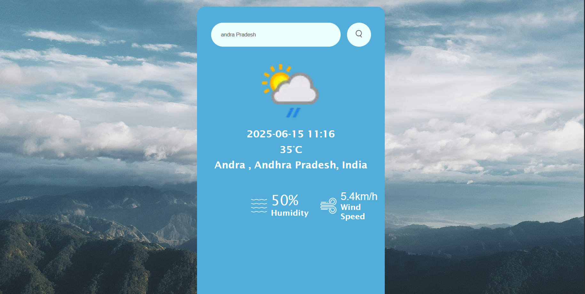
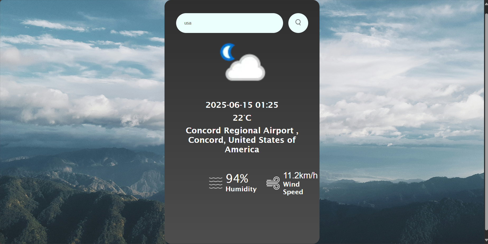

## 🌦️ Weather App

This is my first web development project built using **HTML**, **CSS**, and **JavaScript**.  
It fetches real-time weather data using the **OpenWeatherMap API**.

# 🚀 Features

- Fetches live weather data by **city name**
- Displays:
- - 📅 Date
  - 🌍 Location
  - 🌡️ Temperature
  - 💨 Wind Speed
  - 💧 Humidity
- Dynamic **background color change** for night-time detection
- Clean and responsive **UI** with weather-related icons for good user experience

# 🧠 What I Learned

- Fetching API data using JavaScript
- Parsing JSON responses
- DOM manipulation
- Responsive design using CSS
- Handling user input and basic error handling

# 📸 Screenshots

### Main View

### Night Mode Example

# 📁 Tech Stack

- HTML
- CSS
- JavaScript
- OpenWeatherMap API

## 📬 Contact

If you'd like to connect:  
[LinkedIn](https://www.linkedin.com/in/harsha-vardhani-4a546b323?utm_source=share&utm_campaign=share_via&utm_content=profile&utm_medium=android_app)  
Email: harshavardhani.145@gmail.com
